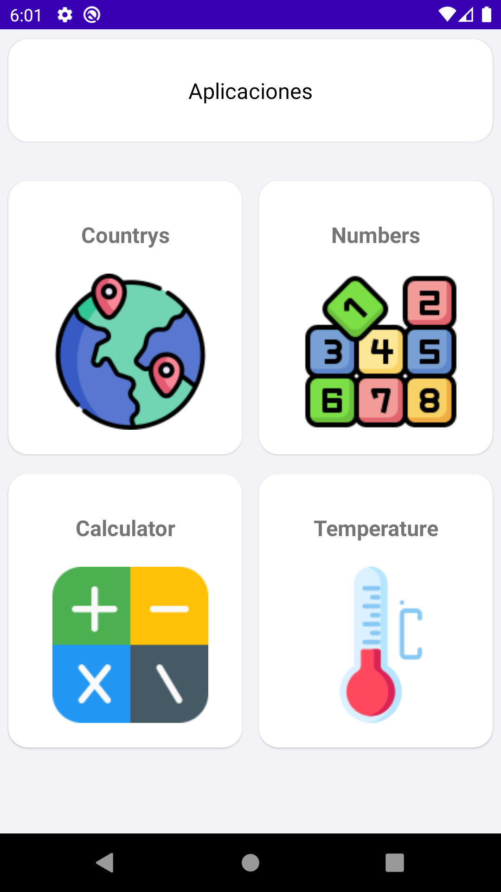
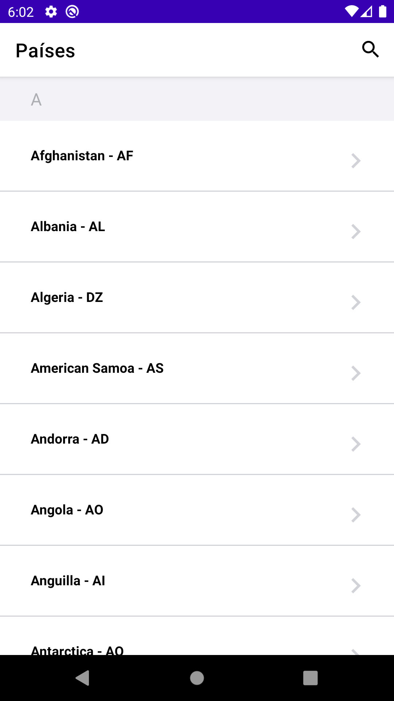
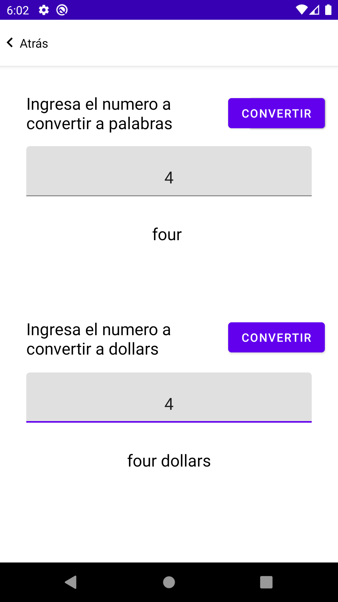
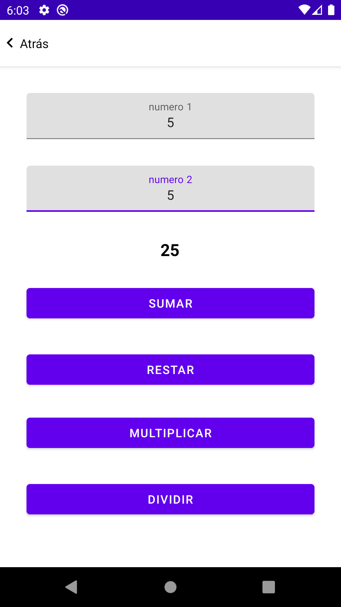
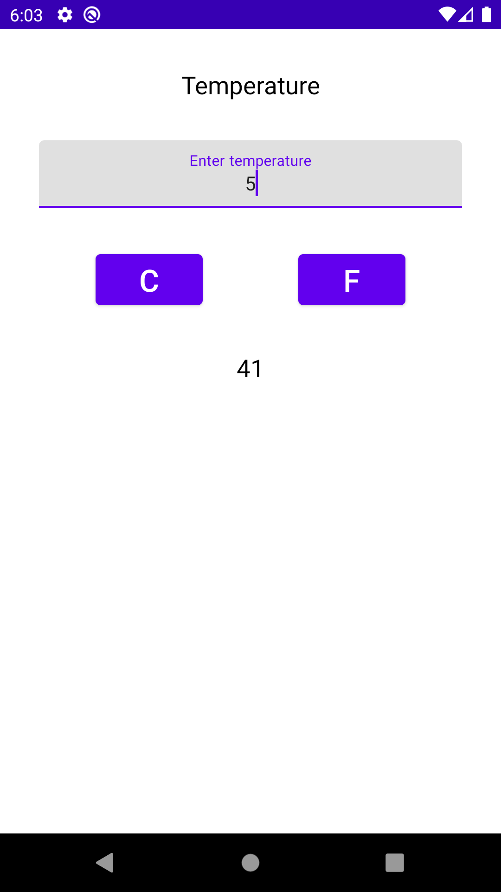

# SoapJavaRetrofit

Proyecto en el cual se dan varios ejemplos de como consumir servicios soap usando retrofit , este proyecto tambien tiene codigo java y kotlin para entender un pocos de como usarlos en el mismo proyecto.

los servicios que se consumen los puedes encontrar en el siguiente link

https://www.postman.com/cs-demo/workspace/public-soap-apis/overview


## Aplication

<table>
  <tr>
    <td><strong>Home</strong></td>
   <td><strong>Paises</strong></td>
    <td><strong>Numbers</strong></td>
  </tr>
  <tr>
    <td></td>
    <td></td>
    <td></td>
  </tr>
  <tr>
    <td><strong>Calculadora</strong></td>
   <td><strong>Temperatura</strong></td>
  </tr>
  <tr>
    <td></td>
    <td></td>
  </tr>
</table>


## Ejemplo 

## postman
#### request

```xml
<?xml version="1.0" encoding="utf-8"?>
<soap:Envelope xmlns:xsi="http://www.w3.org/2001/XMLSchema-instance" xmlns:xsd="http://www.w3.org/2001/XMLSchema" xmlns:soap="http://schemas.xmlsoap.org/soap/envelope/">
  <soap:Body>
    <Add xmlns="http://tempuri.org/">
      <a>1</a>
      <b>3</b>
    </Add>
  </soap:Body>
</soap:Envelope>

```
#### response

```xml
<?xml version="1.0" encoding="utf-8"?>
<soap:Envelope xmlns:soap="http://schemas.xmlsoap.org/soap/envelope/" xmlns:xsi="http://www.w3.org/2001/XMLSchema-instance" xmlns:xsd="http://www.w3.org/2001/XMLSchema">
    <soap:Body>
        <AddResponse xmlns="http://tempuri.org/">
            <AddResult>4</AddResult>
        </AddResponse>
    </soap:Body>
</soap:Envelope>

```

## java models

### request

```java

import org.simpleframework.xml.Element;
import org.simpleframework.xml.Namespace;
import org.simpleframework.xml.NamespaceList;
import org.simpleframework.xml.Root;

@Root(name = "soap:Envelope")
@NamespaceList({
        @Namespace(prefix = "xsi", reference = "http://www.w3.org/2001/XMLSchema-instance"),
        @Namespace(prefix = "xsd", reference = "http://www.w3.org/2001/XMLSchema"),
        @Namespace(prefix = "soap", reference = "http://schemas.xmlsoap.org/soap/envelope/"),
})
public class RequestCalculatorAdd {
    @Element(name = "soap:Body")
    private Body body;

    public Body getBody() {
        return body;
    }

    public void setBody(Body body) {
        this.body = body;
    }

    @Root(name = "soap:Body")
    public static class Body {
        @Element(name = "Add")
        private Add add;

        public Add getAdd() {
            return add;
        }

        public void setAdd(Add add) {
            this.add = add;
        }
    }

    @Root(name = "Add")
    @NamespaceList({
            @Namespace(reference = "http://tempuri.org/"),
    })
    public static class Add {
        @Element(name = "a")
        private Integer a;

        public Integer getA() {
            return a;
        }

        public void setA(Integer a) {
            this.a = a;
        }

        @Element(name = "b")
        private Integer b;

        public Integer getB() {
            return b;
        }

        public void setB(Integer b) {
            this.b = b;
        }
    }

}

```

### response

```java

import org.simpleframework.xml.Element;
import org.simpleframework.xml.Root;

@Root(name = "Envelope")
public class ResponseCalculatorAdd {
    @Element(name = "Body")
    private Body body;

    public Body getBody() {
        return body;
    }

    @Root(name = "Body")
    public static class Body {
        @Element(name = "AddResponse")
        private AddResponse addResponse;

        public AddResponse getAddResponse() {
            return addResponse;
        }
    }


    @Root(name = "AddResponse")
    public static class AddResponse {
        @Element(name = "AddResult")
        private String addResult;

        public String getAddResult() {
            return addResult;
        }
    }

}


```


